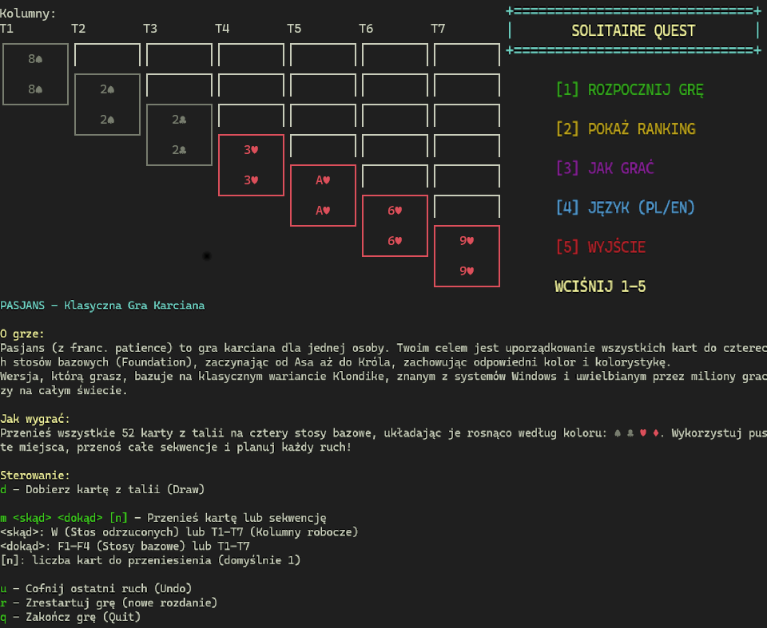

# 🎮 Solitaire Game

<p align="center">
  
</p>

## 📋 Spis treści
- [Instalacja](#-instalacja)
- [Uruchomienie](#-uruchomienie)
- [Sterowanie](#-sterowanie)
- [Zasady gry](#-zasady-gry)
- [Struktura projektu](#-struktura-projektu)
- [Dokumentacja kodu](#-dokumentacja-kodu)

## 🛠️ Instalacja

### Wymagania
- Kompilator C++ (np. g++)
- System operacyjny Windows/Linux/MacOS

### Kroki instalacji
1. Sklonuj repozytorium:
   ```bash
   git clone [URL_REPOZYTORIUM]
   ```
2. Przejdź do katalogu projektu:
   ```bash
   cd solitaire
   ```
3. Skompiluj projekt:
   - Na Windows: Uruchom plik `build.bat`
   - Na Linux/MacOS: 
     ```bash
     g++ -o solitaire main.cpp src/*.cpp -I include
     ```

## 🚀 Uruchomienie

Po skompilowaniu, uruchom grę:
- Na Windows: Uruchom plik `build.bat` (skompiluje i uruchomi grę automatycznie)
- Na Linux/MacOS: 
  ```bash
  ./solitaire
  ```

## 🎯 Sterowanie

### Podstawowe komendy
- `d` - Pokaż nowe karty na stosie
- `m` - Wykonaj ruch karty skąd dokąd [ilosc kart]
- `q` - Wyjdź z gry
- `u` - Cofnij ruch [maks 3 razy pod rząd]
- `r` - Resetuj grę

### Ruchy kart
Format: `m [źródło] [cel] [n opcjonalnie]`
- Źródło/cel może być:
  - `W` - Waste (stos odrzuconych kart)
  - `T1-T7` - Tableau (kolumny na planszy)
  - `F1-F4` - Foundation (stosy docelowe)

Przykłady:
- `W F1` - Przenieś kartę z waste na pierwszą foundation
- `T1 T2` - Przenieś kartę z pierwszej kolumny na drugą
- `F1 T3` - Przenieś kartę z pierwszej foundation na trzecią kolumnę

## 🎲 Zasady gry

### Cel gry
Ułóż wszystkie karty w czterech stosach foundation (F1-F4) według kolorów, od asa do króla.

### Zasady
1. **Dobieranie kart**:
   - Kliknij `d` zobaczyć nowe karty na stosie
   - Tylko najwyższa karta na stosie może być używana

2. **Układanie na Kolumnach**:
   - Karty układamy naprzemiennie kolorami
   - Kładziemy kartę z mniejszym numerem na tą z większym

3. **Układanie na foundation**:
   - Zaczynamy od asa
   - Karty muszą być tego samego koloru i znaku
   - Kolejność: A, 2, 3, ..., K

4. **Cofanie ruchów**:
   - Użyj `u` aby cofnąć ostatni ruch
   - Można cofać wszystkie typy ruchów
   - cofać można maksymalnie 3 razy pod rząd

## 📁 Struktura projektu

```
solitaire/
├── include/           # Pliki nagłówkowe
│   ├── card/         # Definicje kart
│   ├── game/         # Logika gry
│   ├── ui/           # Interfejs użytkownika
│   └── utils/        # Narzędzia pomocnicze
├── src/              # Implementacje
│   ├── card/         # Implementacja kart
│   ├── game/         # Implementacja gry
│   ├── ui/           # Implementacja UI
│   └── utils/        # Implementacja narzędzi
└── main.cpp          # Punkt wejścia
```

## 📚 Dokumentacja kodu

### Główne klasy

#### Game
- Klasa zarządzająca stanem gry
- Metody:
  - `run()` - Główna pętla gry
  - `save()` - Zapisz stan gry
  - `load()` - Wczytaj stan gry

#### Card
- Reprezentacja karty
- Atrybuty:
  - `suit` - Kolor (♠, ♥, ♦, ♣)
  - `rank` - Wartość (A, 2-10, J, Q, K)

#### Command
- Wzorzec Command dla operacji w grze
- Podklasy:
  - `DrawCommand` - Dobieranie kart
  - `MoveCardCommand` - Przenoszenie kart
  - `MoveSequenceCommand` - Przenoszenie sekwencji

#### GameComponents
- Komponenty gry:
  - `Stock` - Talia
  - `Waste` - Stos odrzuconych kart
  - `Tableau` - Kolumny na planszy
  - `Foundation` - Stosy docelowe

### Interfejs użytkownika
- Konsolowy interfejs z kolorowym wyświetlaniem
- Obsługa wielu języków
- Czytelne formatowanie planszy

## 🎨 Style i formatowanie
- Karty są wyświetlane w kolorach:
  - ♠♣ - Czarny
  - ♥♦ - Czerwony
- Plansza jest formatowana z odpowiednimi odstępami
- Komunikaty są wyświetlane w czytelny sposób

## 📝 Licencja
Ten projekt jest dostępny na licencji MIT.