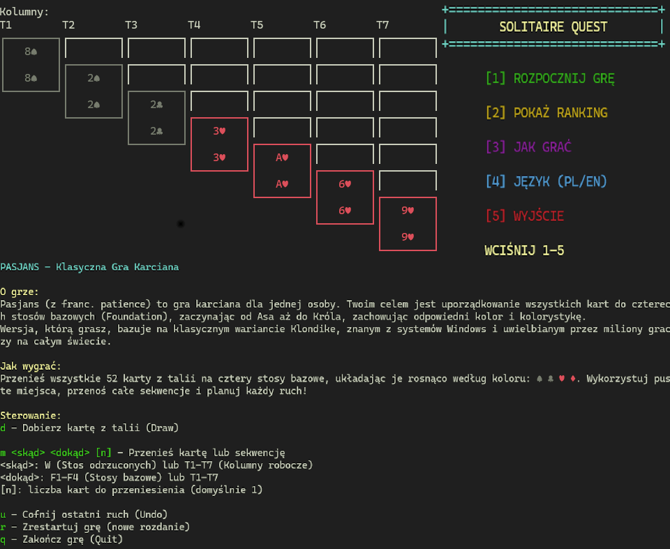

# 🎮 Solitaire Game

A complete Klondike solitaire implementation in C++ with a colored terminal interface,
multi-step undo built on the command pattern, and a modular class structure.
Written for the Gigathon national programming competition.

<p align="center">
  
</p>

## 📋 Table of contents
- [Installation](#️-installation)
- [Running the game](#-running-the-game)
- [Controls](#-controls)
- [Rules](#-rules)
- [Project structure](#-project-structure)
- [Code documentation](#-code-documentation)

## 🛠️ Installation

### Requirements
- A C++ compiler (e.g. g++)
- Windows, Linux or macOS

### Steps
1. Clone the repository:
   ```bash
   git clone https://github.com/Johnn2012-y/Solitaire.git
   ```
2. Enter the project directory:
   ```bash
   cd Solitaire
   ```
3. Build:
   - **Windows:** run `build.bat`
   - **Linux / macOS:**
     ```bash
     g++ -o solitaire main.cpp src/*.cpp -I include
     ```

## 🚀 Running the game

- **Windows:** run `build.bat` — it compiles and launches the game in one step
- **Linux / macOS:**
  ```bash
  ./solitaire
  ```

## 🎯 Controls

### Commands
- `d` — draw new cards from the stock
- `m` — move a card: from, to, [number of cards]
- `u` — undo the last move (up to 3 in a row)
- `r` — reset the game
- `q` — quit

### Moving cards
Format: `m [source] [target] [n, optional]`

Source and target can be:
- `W` — waste (discard pile)
- `T1`–`T7` — tableau columns
- `F1`–`F4` — foundation piles

Examples:
- `m W F1` — move a card from the waste to the first foundation
- `m T1 T2` — move a card from the first tableau column to the second
- `m F1 T3` — move a card from the first foundation back to the third column

## 🎲 Rules

### Goal
Build all four foundation piles (`F1`–`F4`) up by suit, from ace to king.

### How play works
1. **Drawing cards**
   - Press `d` to turn new cards from the stock
   - Only the top card of the waste can be played

2. **Building the tableau**
   - Cards are stacked in alternating colors (red on black, black on red)
   - Each card must be one rank lower than the one it is placed on

3. **Building the foundations**
   - Each foundation starts with an ace
   - Cards must follow the same suit
   - Order: A, 2, 3, …, K

4. **Undo**
   - Press `u` to take back the last move
   - Every move type can be undone
   - Up to 3 consecutive undos

## 📁 Project structure

```
solitaire/
├── include/          # Header files
│   ├── card/         # Card definitions
│   ├── game/         # Game logic
│   ├── ui/           # User interface
│   └── utils/        # Helpers
├── src/              # Implementations
│   ├── card/
│   ├── game/
│   ├── ui/
│   └── utils/
└── main.cpp          # Entry point
```

## 📚 Code documentation

### Main classes

#### `Game`
Owns and drives the game state.
- `run()` — main game loop
- `save()` — save the current state
- `load()` — restore a saved state

#### `Card`
Represents a single card.
- `suit` — ♠ ♥ ♦ ♣
- `rank` — A, 2–10, J, Q, K

#### `Command`
Command pattern wrapping every in-game operation, which is what makes undo possible.
- `DrawCommand` — drawing from the stock
- `MoveCardCommand` — moving a single card
- `MoveSequenceCommand` — moving a sequence of cards

#### `GameComponents`
- `Stock` — the deck
- `Waste` — discard pile
- `Tableau` — the seven columns
- `Foundation` — the four target piles

### User interface
Console interface with colored card rendering and a formatted board layout.

## 🎨 Display
- Suits are colored:
  - ♠ ♣ — black
  - ♥ ♦ — red
- The board is laid out with fixed spacing for readability

## 📝 License
MIT.
